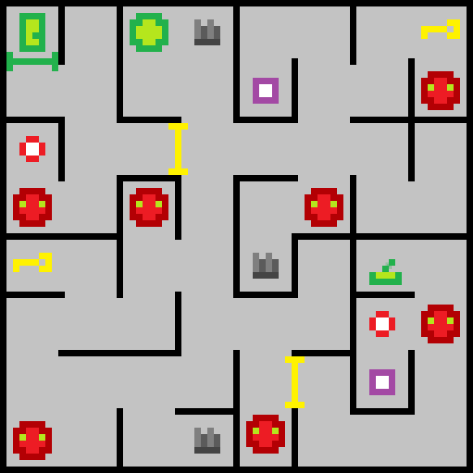

# Unity_FPS_game

* Собран уровень по концепту
* Написан скрипт для управления игроком
* Реализован спаунер противников
* Враги разворачиваются в сторону игрока и стреляют
* Враги передвигаются по карте через NavMesh
* Реализованы двери, которые открываются, только если у игрока есть ключ
* Реализован прыжок. Если зажать пробел, то игрок прыгает выше
* Реализованы часы с анимированной стрелкой
* Игру можно пройти, если дойти до конца уровня

