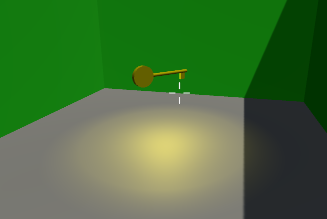
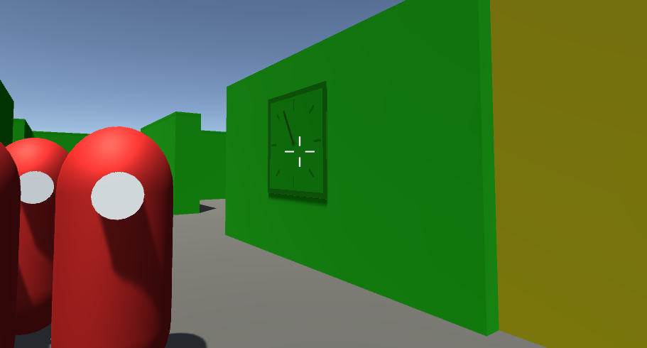
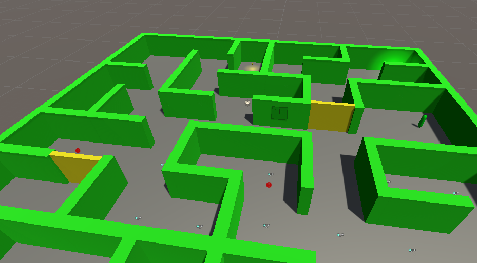

# Unity_FPS_game

* Собран уровень по концепту
* Написан скрипт для управления игроком
* Реализован спаунер противников
* Враги разворачиваются в сторону игрока и стреляют
* Реализованы двери, которые открываются, только если у игрока есть ключ

